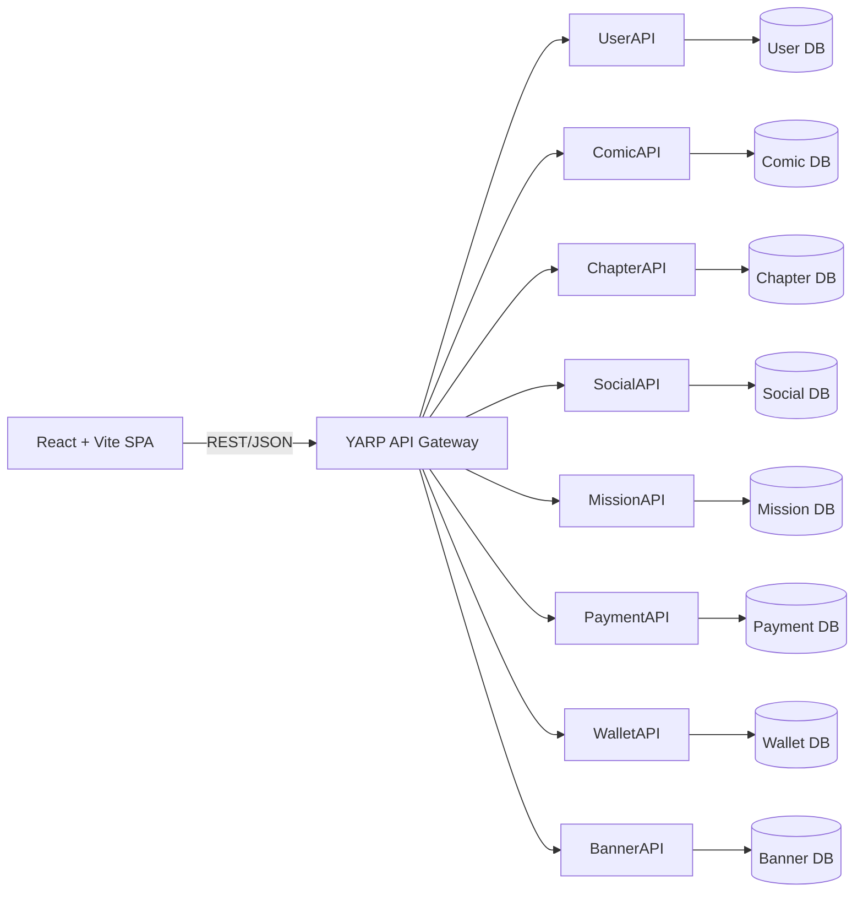
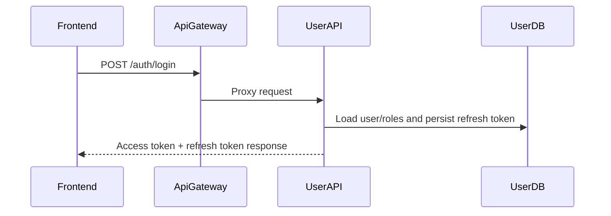
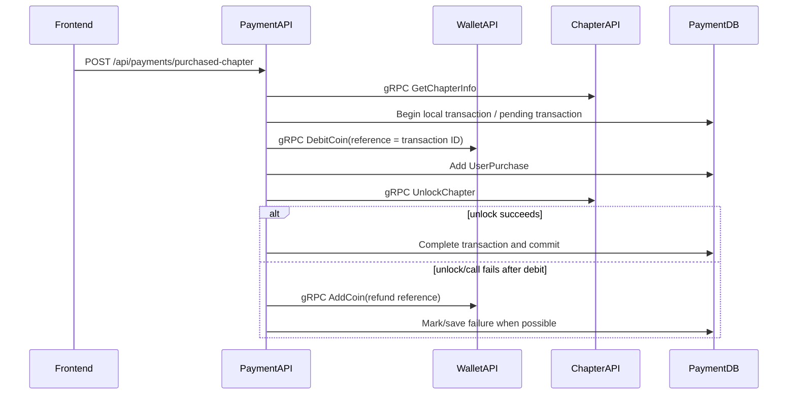

# Current Architecture

This document describes `CURRENT` runtime architecture only. Approved target architecture and migration sequence remain in planning/decision documents until source code, project references, and runtime structure actually change.

## System overview



The repository is a monorepo. The frontend uses one public backend origin: `ApiGateway`. YARP maps public path prefixes to eight independently hosted ASP.NET Core APIs. Each business API has its own EF Core context and migration history.

Canonical details:

- Service ownership: [SERVICE_CATALOG.md](SERVICE_CATALOG.md)
- Network contracts: [COMMUNICATION.md](COMMUNICATION.md)
- Database ownership and constraints: [DATABASE.md](DATABASE.md)
- Physical repository layout: [PROJECT_STRUCTURE.md](PROJECT_STRUCTURE.md)

## Runtime components

| Component | Current responsibility |
|---|---|
| React/Vite frontend | Browser UI, client-side routing, JWT storage/use, REST calls |
| ApiGateway | YARP reverse proxy, edge JWT authentication, public/protected-path check, CORS, selected error normalization |
| Eight business APIs | Domain-specific REST endpoints, synchronous gRPC servers/clients, persistence |
| SQL Server | Separate logical database connection per service |
| Cloudinary | Avatar, comic cover, chapter page, banner, and mission upload storage depending on service |
| n8n + LibreTranslate | Text translation webhook used by ComicAPI |
| SMTP + Google Auth | Email workflows and Google login in UserAPI |
| VietQR + SePay | Deposit QR generation and bank webhook processing in PaymentAPI |
| Redis | IMPLEMENTED: Cache-Aside pattern for ComicAPI endpoints |
| RabbitMQ | IMPLEMENTED: Mission activity events via MassTransit AND Payment Saga State Machine |

## Architecture inside services

### Current pattern

### Current pattern

All business services have been migrated to a Clean Architecture pattern, structured as four separate `.csproj` projects per service: `.API`, `.Application`, `.Domain`, and `.Infrastructure`.

```text
.API (REST Controller or gRPC adapter, Composition Root)
              ↓
.Application (Use Cases, DTOs, Interfaces, Service implementations)
              ↓
.Domain (Entities, Domain Interfaces)
              ↑
.Infrastructure (DbContext, Repositories, External Adapters)
```

This ensures that the domain and application layers have no dependencies on infrastructure or transport logic. The compiler strictly enforces these architectural boundaries.

Not every operation needs persistence. Translation and image upload flow from controller to a service and then to an external adapter without a repository.

### Dependency direction currently enforced by compiler

- `.API` depends on `.Application` and `.Infrastructure` (for DI registration only).
- `.Infrastructure` depends on `.Application` (to implement interfaces).
- `.Application` depends on `.Domain`.
- `.Domain` has no dependencies on other layers.
- Public REST responses use DTOs/response wrappers rather than returning EF entities directly.

See [CONVENTIONS.md](CONVENTIONS.md) for required versus observed conventions.

## API Gateway

`ApiGateway` is not a business service and has no database. It loads YARP routes from `ApiGateway/appsettings.json` and routes `/auth`, `/comics`, `/categories`, `/translations`, `/chapters`, social paths, payments, wallet paths, missions, notifications, uploads, and banners.

Gateway behavior implemented in `Program.cs`:

- JWT Bearer authentication using shared issuer/audience/secret configuration.
- CORS for one configured frontend origin, defaulting to `http://localhost:5173`.
- A hard-coded public-path allowlist; unmatched/protected requests without an authenticated user return `401`.
- Conversion of selected `401`, `404`, `502`, and `503` responses to the shared `ApiResponse` JSON shape.
- `502` from an unavailable downstream service is exposed as `503`.

The downstream APIs also configure JWT authentication and controller authorization. Gateway authentication is therefore not the only authorization boundary.

## Database-per-service

The code has eight service-owned `DbContext` types. Cross-service references such as user, comic, or chapter IDs are scalar values; they are not EF navigation properties to another service database. No service registers another service's `DbContext`.

The repository does not contain a shared database context or cross-database foreign keys. Exact constraints and startup migration behavior are documented in [DATABASE.md](DATABASE.md).

## Synchronous communication

The current backend uses gRPC for internal calls that either query another service or perform a synchronous command. Examples include:

- ComicAPI looking up users and chapter information.
- PaymentAPI querying/unlocking ChapterAPI and debiting/crediting WalletAPI.

There are circular synchronous dependencies at service level, though ChapterAPI ↔ MissionAPI and SocialAPI ↔ MissionAPI are being decoupled via RabbitMQ events. See [COMMUNICATION.md](COMMUNICATION.md).

## Asynchronous communication

**IMPLEMENTED.** 
- Mission progress events are published by ChapterAPI/SocialAPI and consumed by MissionAPI via MassTransit and RabbitMQ.
- Mission reward events are published by MissionAPI and consumed by WalletAPI via MassTransit and RabbitMQ.

## Authentication and authorization

UserAPI issues JWT access tokens and refresh tokens. It supports registration, email verification, login/logout, refresh, password reset, Google login, profile updates, avatar upload, and admin user management.

Roles seeded by `UserDbContext` are `Admin`, `Guest`, and `Reader`. Controllers use `[Authorize]` and role restrictions. The Gateway additionally classifies routes as public or protected.

Current behavior: JWT validation is configured identically in every service using `builder.Services.AddCustomJwtAuthentication(builder.Configuration)`. All services validate issuer and audience strictly.

## Important runtime flows

### Login



The frontend stores tokens in `localStorage`. Admin UI routes additionally call `/auth/me` to verify the current role.

### Browse and read a chapter

1. Frontend requests comic metadata through `/comics` and chapters through `/chapters`.
2. ComicAPI may call UserAPI for author data and ChapterAPI for counts/purchased comic IDs.
3. ChapterAPI restricts public chapter listings to `Published` status.
4. For page access, ChapterAPI checks price/purchase state in ChapterDB.
5. Reading activity is published asynchronously to MissionAPI via RabbitMQ; reading history is separately stored in SocialDB when the frontend posts `/reading-history`.

### Purchase a paid chapter



Wallet credit/debit is idempotent by unique `CurrencyEntry.ReferenceId`. PaymentAPI contains a best-effort compensation path that refunds a successful debit if chapter unlock fails. This is not a persisted purchase state machine or distributed transaction; a process/network failure can still require reconciliation.

### Deposit through VietQR/SePay

1. Frontend creates a pending deposit through `/payments/deposit`.
2. PaymentAPI persists a unique transaction code and returns a VietQR image URL.
3. SePay sends an authenticated webhook to `/payments/sepay-webhook`.
4. PaymentAPI extracts the transaction code, requires a pending transaction, and uses the amount actually received.
5. PaymentAPI calls WalletAPI `AddCoin` using the payment transaction ID as idempotency reference.
6. After wallet credit succeeds, PaymentAPI marks the transaction completed.

If wallet credit fails, the transaction remains pending so the webhook can be retried. The webhook fails closed when the SePay API key is not configured.

### Wallet and withdrawal

- WalletAPI owns wallet balance, ledger entries, and withdrawal requests.
- Credit/debit operations run under serializable local transactions and deduplicate by `ReferenceId`.
- Withdrawable balance excludes unspent mission-reward credit according to `WalletRules`.
- One pending withdrawal per wallet is enforced by a filtered unique index.
- Creating a withdrawal deducts amount plus fee; rejecting it refunds both through a ledger entry.

### Missions and activity

- ChapterAPI and SocialAPI publish MissionActivityRecordedEvent asynchronously via RabbitMQ, using the MassTransit Entity Framework Core Outbox pattern for guaranteed delivery.
- MissionAPI also calls ChapterAPI and SocialAPI to synchronize historical activity snapshots.
- `MissionActivity` has a unique `(UserId, MissionId, ActivityId)` index to prevent duplicate counting.
- Completing a mission publishes a `MissionRewardGrantedEvent` asynchronously via RabbitMQ so wallet credit can be processed and deduplicated safely using the Outbox pattern.

### Comment/social activity

- SocialAPI owns comments, favorites, follows, and reading history.
- Comments support one parent/replies relationship.
- Comment creation validates the comic through the Gateway's public `GET /comics/{id}` route, then publishes a mission progress event via RabbitMQ. Validation fails closed when the Gateway or ComicAPI cannot return a successful response.
- Favorite, follow, and reading-history records have composite unique constraints.

### Translation

```text
Frontend -> Gateway /translations -> ComicAPI -> n8n webhook -> LibreTranslate
```

Only text is sent. The n8n workflow is stored under `backend/n8n/workflows/`. Translation is unavailable when the webhook is not configured/reachable; other APIs can continue running.

## External integrations

| Service | Integration | Purpose |
|---|---|---|
| UserAPI | SMTP via MailKit | Verification and password-reset email |
| UserAPI | Google token validation | Google login |
| UserAPI | Cloudinary | Avatar storage |
| ComicAPI | Cloudinary | Comic cover storage |
| ComicAPI | n8n webhook / LibreTranslate | Text translation |
| ChapterAPI | Cloudinary | Chapter page storage |
| MissionAPI | Cloudinary | Upload storage |
| PaymentAPI | VietQR image endpoint | Deposit QR generation |
| PaymentAPI | SePay webhook | Incoming transfer confirmation |
| BannerAPI | Cloudinary | Banner image storage |

## Current constraints and limitations

This section classifies current limitations; it is not a migration backlog.

| Category | Current limitation | Main risk | Canonical detail/change owner |
|---|---|---|---|
| Data / configuration | Committed connection-string values are empty | Runtime requires correctly supplied environment configuration | [DEVELOPMENT.md](DEVELOPMENT.md) |
| Reliability | Payment -> Wallet -> Chapter purchase orchestration uses MassTransit Saga | Balance, payment record, and entitlement are eventual consistent | [DATABASE.md](DATABASE.md) and [COMMUNICATION.md](COMMUNICATION.md) |
| Reliability | IMPLEMENTED: Saga and persisted cross-service purchase state machine. (RabbitMQ events use Outbox pattern) | Cross-service RabbitMQ delivery is durable | [COMMUNICATION.md](COMMUNICATION.md) and [DECISIONS.md](DECISIONS.md) |
| Coupling | ChapterAPI ↔ MissionAPI and SocialAPI ↔ MissionAPI forms synchronous cycles | Availability and deployment coupling | [COMMUNICATION.md](COMMUNICATION.md) |
| Verification | No automated test project is committed | Critical flows rely on build/manual verification | [DEVELOPMENT.md](DEVELOPMENT.md) |
| Observability | Default ASP.NET Core logging only; no standardized correlation or distributed tracing/OpenTelemetry | Cross-service failures are harder to trace | [CONVENTIONS.md](CONVENTIONS.md) |

These limitations do not mean the proposed replacement architecture is already approved or implemented. Canonical documents must be updated only when the corresponding code/configuration changes.
