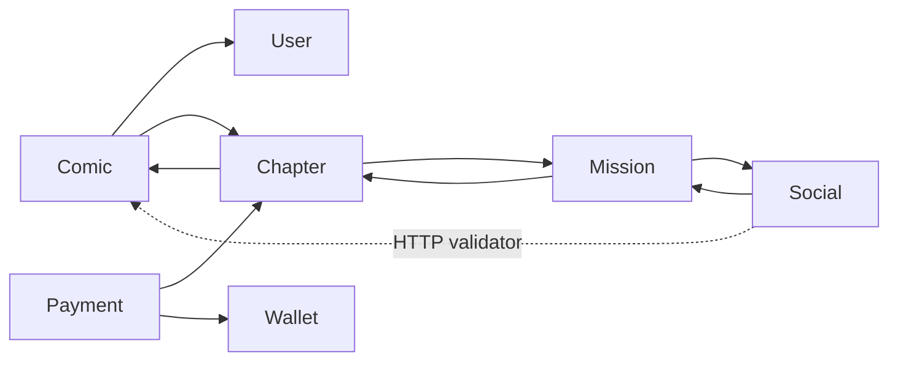

# Communication Map

This document is the canonical map of current inter-component communication.

## Communication types currently implemented

| Type | Status | Use |
|---|---|---|
| Browser REST/JSON through YARP | IMPLEMENTED | All frontend-to-backend calls |
| Internal gRPC | IMPLEMENTED | Synchronous queries and commands between APIs |
| Internal HTTP client | IMPLEMENTED in one place | SocialAPI comic validation |
| RabbitMQ integration events | IMPLEMENTED | Mission progress events from SocialAPI/ChapterAPI to MissionAPI |
| Redis cache | IMPLEMENTED in ComicAPI | Caching heavily accessed comic lists |

## Frontend → Gateway → REST APIs

The frontend uses `VITE_API_URL` as its optional base URL. In development it is normally empty, and Vite proxies configured path prefixes to `http://127.0.0.1:5028`.

YARP mapping:

| Public prefix | Destination | Downstream path behavior |
|---|---|---|
| `/auth/**` | UserAPI `http://127.0.0.1:5054` | Preserved |
| `/comics/**` | ComicAPI `http://127.0.0.1:5023` | Rewritten to `/api/comics/**` |
| `/categories/**` | ComicAPI | Rewritten to `/api/categories/**` |
| `/translations/**` | ComicAPI | Rewritten to `/api/translations/**` |
| `/chapters/**` | ChapterAPI `http://127.0.0.1:5115` | Rewritten to `/api/chapters/**` |
| `/comments/**` | SocialAPI `http://127.0.0.1:5197` | Rewritten to `/api/comments/**` |
| `/favorites/**` | SocialAPI | Rewritten to `/api/favorites/**` |
| `/follows/**` | SocialAPI | Rewritten to `/api/follows/**` |
| `/reading-history/**` | SocialAPI | Rewritten to `/api/reading-history/**` |
| `/payments/**` | PaymentAPI `http://127.0.0.1:5128` | Rewritten to `/api/payments/**` |
| `/wallets/**` | WalletAPI `http://127.0.0.1:5091` | Preserved; no current REST controller matches this prefix |
| `/currency/**` | WalletAPI | Preserved |
| `/withdraws/**` | WalletAPI | Preserved |
| `/banners/**` | BannerAPI `http://127.0.0.1:5127` | Preserved |
| `/uploads/**` | MissionAPI `http://127.0.0.1:5288` | Rewritten to `/api/uploads/**` |
| `/missions/**` | MissionAPI | Rewritten to `/api/missions/**` |
| `/notifications/**` | MissionAPI | Rewritten to `/api/notifications/**` |

### Gateway public-path policy

The current Gateway middleware permits unauthenticated access to:

- login, register, forgot/reset password, refresh-token, resend-confirm, Google login, and email-verification paths;
- banner GET;
- category GET;
- translation POST;
- public comic GET except `/comics/me` and `/comics/purchased`;
- chapter GET;
- comment GET;
- SePay webhook POST.

Other matched Gateway routes require an authenticated JWT. Downstream controller authorization still applies.

### Vite proxy coverage

`vite.config.js` proxies the prefixes currently used by the UI, including `/withdraws`. It does not proxy `/wallets`, `/currency`, or `/uploads`, even though Gateway routes exist for them. This matters only when the browser calls those relative paths in Vite development.

## gRPC contracts

Proto files are duplicated between providers and consumers. Changes must keep all copies compatible.

| Caller | Receiver | Type | Interaction semantics | Contract / RPC | Purpose | Why synchronous now |
|---|---|---|---|---|---|---|
| ComicAPI | UserAPI | gRPC | Query | `user.proto`: `GetUserById`, `GetUsersByIds`, `ValidateToken` | Enrich/validate user and author information | Comic responses need user data immediately |
| ComicAPI | ChapterAPI | gRPC | Query | `chapter.proto`: `GetChapterCount`, `GetPurchasedComicIds` | Enrich comic catalog/detail and purchased listing | Response construction waits for chapter data |
| ChapterAPI | ComicAPI | gRPC | Query / command | `comic.proto`: `CheckComicExists`, `IncrementComicView` | Validate comic and increment view | Current chapter use cases call directly |
| ChapterAPI | MissionAPI | gRPC | Notification implemented synchronously | `mission_progress.proto`: `RecordActivity` | Record read/purchase mission activity | Current notifier waits for MissionAPI |
| SocialAPI | MissionAPI | gRPC | Notification implemented synchronously | `mission_progress.proto`: `RecordActivity` | Record comment/read activity | Current service waits for MissionAPI |
| MissionAPI | ChapterAPI | gRPC | Query | `chapter_activity.proto`: `GetUserPurchaseActivities` | Reconstruct/synchronize purchase activity | Mission synchronization requests a snapshot |
| MissionAPI | SocialAPI | gRPC | Query | `social_activity.proto`: `GetUserActivities` | Reconstruct read/comment activity | Mission synchronization requests a snapshot |
| PaymentAPI | ChapterAPI | gRPC | Query / command requiring result | `chapter.proto`: `GetChapterInfo`, `UnlockChapter`, `IsChapterPurchased` | Price/status lookup and entitlement | Purchase decision and response depend on result |
| PaymentAPI | WalletAPI | gRPC | Command requiring immediate result | `wallet.proto`: `DebitCoin`, `AddCoin` | Purchase debit, deposit credit, purchase refund | Balance/failure result is required by current flow |

The semantics column classifies current behavior; it does not assert that any interaction has already been approved or implemented as asynchronous messaging.

### gRPC providers

| Provider | Server implementation | Contract |
|---|---|---|
| UserAPI | `GrpcServices/UserGrpcService.cs` | `UserService` |
| ComicAPI | `GrpcServices/ComicGrpcService.cs` | `ComicGrpc` |
| ChapterAPI | `GrpcServices/ChapterGrpcService.cs` | `ChapterGrpc` |
| SocialAPI | `GrpcServices/SocialActivityGrpcService.cs` | `SocialActivity` |
| MissionAPI | `GrpcServices/MissionProgressGrpcService.cs` | `MissionProgress` |
| WalletAPI | `GrpcServices/WalletGrpcService.cs` | `WalletService` |

BannerAPI and PaymentAPI do not host gRPC services.

## Internal HTTP communication

SocialAPI registers `IComicValidator` with an `HttpClient`. Its base address uses `API_GATEWAY_URL`, then `ApiGateway:BaseUrl`, and finally the local Gateway fallback `http://127.0.0.1:5028`. It requests the Gateway contract `GET /comics/{id}`, which YARP rewrites to ComicAPI `GET /api/comics/{id}`.

Only a successful upstream response confirms that the comic exists. `404`, other non-success statuses, request failures, and timeouts all fail closed, so SocialAPI does not create a comment or favorite for an unvalidated comic ID. Communication failures are logged without changing the existing public SocialAPI response contracts.

## Synchronous dependency graph

Current circular service dependencies:

- ComicAPI ↔ ChapterAPI.
- ChapterAPI ↔ MissionAPI.
- SocialAPI ↔ MissionAPI.

These cycles increase availability coupling. They are documented here but are not refactored by this documentation task.

## RabbitMQ / integration events

### Status: IMPLEMENTED

Docker Compose starts RabbitMQ at:

- AMQP: `5672`
- Management UI: `15672`

The following events are currently implemented via MassTransit:

| Publisher | Event | Consumer | Exchange | Routing / Queue | Purpose |
|---|---|---|---|---|---|
| SocialAPI / ChapterAPI | `MissionActivityRecordedEvent` | MissionAPI | `SharedKernel.Events:MissionActivityRecordedEvent` | `mission-activity-recorded` | Notify MissionAPI of user activities asynchronously |
| MissionAPI | `MissionRewardGrantedEvent` | WalletAPI | `SharedKernel.Events:MissionRewardGrantedEvent` | `mission-reward-granted` | Credit mission reward asynchronously via Outbox pattern |

## Reliability characteristics

| Flow | Current mechanism | Limitation |
|---|---|---|
| Wallet credit/debit | Serializable local DB transaction + unique `ReferenceId` | Only protects WalletDB; no distributed transaction |
| Deposit webhook | Pending-state check + wallet reference based on payment transaction ID | Payment completion follows synchronous wallet call; no Outbox |
| Chapter purchase | PaymentDB local transaction + Wallet gRPC + Chapter gRPC + best-effort refund | Process/network failure can leave cross-service partial state |
| Mission activity | Unique mission-activity index | Synchronous notification/snapshot calls; no queue retry |
| Mission reward | RabbitMQ Outbox + Wallet idempotency reference | Asynchronous event delivery using Outbox pattern for guaranteed delivery |

## Configuration and endpoint selection

Service clients generally resolve endpoints in this order:

1. environment variable such as `USER_API_URL`, `COMIC_API_URL`, `CHAPTER_API_URL`, `MISSION_API_URL`, `SOCIAL_API_URL`, or `WALLET_API_URL`;
2. a `GrpcEndpoints`/`GrpcSettings` configuration key;
3. a localhost fallback.

Fallback schemes and ports are not fully consistent across projects. Development uses HTTPS launch profiles because several fallback gRPC addresses are HTTPS, while YARP routes to HTTP ports.

## Contract-change checklist

When changing communication:

- Update provider and every copied consumer `.proto`.
- Verify `.csproj` `GrpcServices` mode and `Program.cs` registration.
- Preserve YARP public paths and transforms or update frontend callers in the same task.
- Check Gateway public-path policy and downstream `[Authorize]` attributes.
- Update this document and [SERVICE_CATALOG.md](SERVICE_CATALOG.md).
- If a real RabbitMQ event is introduced, document producer, event version, consumer, exchange, routing key, queue, and reliability mechanism here.
